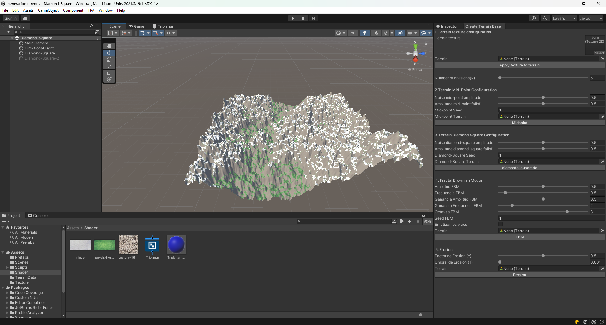

# 🌍 Generación Procedural de Terrenos + Shader Triplanar  

  

## 📌 Descripción  

Este proyecto combina **algoritmos de generación procedural de terrenos** con la implementación de un **shader triplanar avanzado** que incorpora efectos de **agua** y **nieve**.  

El flujo del proyecto se divide en dos partes:  

1. 🏔️ **Generación procedural de terreno**  
   - Implementación de **tres algoritmos diferentes**:  
     - **Midpoint Displacement (Punto Medio)** → subdivisión recursiva para generar relieve natural.  
     - **Diamond-Square** → creación de terrenos fractales con mayor detalle.  
     - **Fractal Brownian Motion (fBm)** → combinación de ruidos fractales para dar mayor realismo.  
   - La generación se gestiona desde una **ventana personalizada del editor de Unity**, lo que permite configurar parámetros sin necesidad de ejecutar la escena.  

2. 💧❄️ **Shader triplanar con agua y nieve**  
   - Creado con **Shader Graph**, incorporando **nodos personalizados** para un mayor control visual.  
   - El shader adapta automáticamente las texturas según la **normal de cada vértice/píxel**, logrando una integración suave entre las distintas proyecciones.  
   - Incluye blending dinámico entre **texturas de nieve y agua** para realismo adicional.  

---

## 🚀 Tecnologías utilizadas  

- **Motor de desarrollo:** Unity  
- **Lenguaje:** C#  
- **Shader:** Shader Graph con nodos personalizados  
- **Algoritmos:** Midpoint Displacement, Diamond-Square, Fractal Brownian Motion (fBm)  

---

## 🖼️ Capturas  

- Vista del terreno generado proceduralmente:  
    

---

## 👤 Autor  

- [Enrique Morcillo Martínez](https://github.com/kitex03)  

---

## ✨ Aprendizajes  

- Desarrollo de **herramientas internas en Unity** (ventanas de editor personalizadas).  
- Implementación de **Midpoint Displacement, Diamond-Square y fBm** para generación procedural.  
- Creación de shaders avanzados con **Shader Graph** y nodos propios.  
- Manejo de **blending dinámico de texturas** en triplanar mapping (agua/nieve).  

